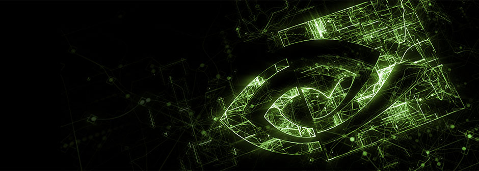
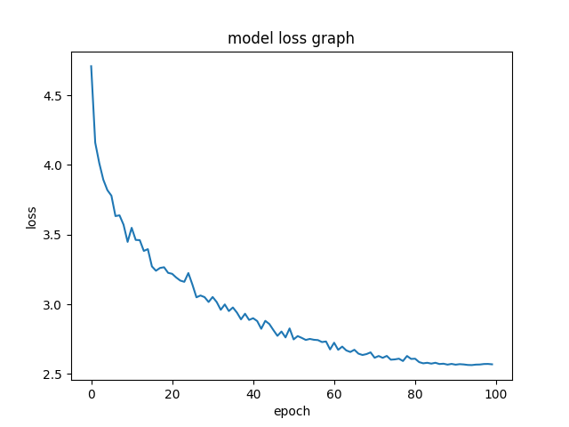
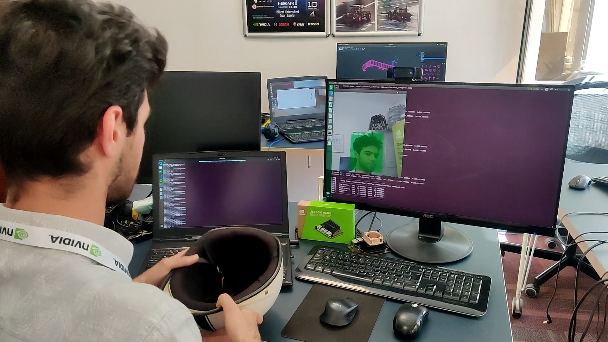
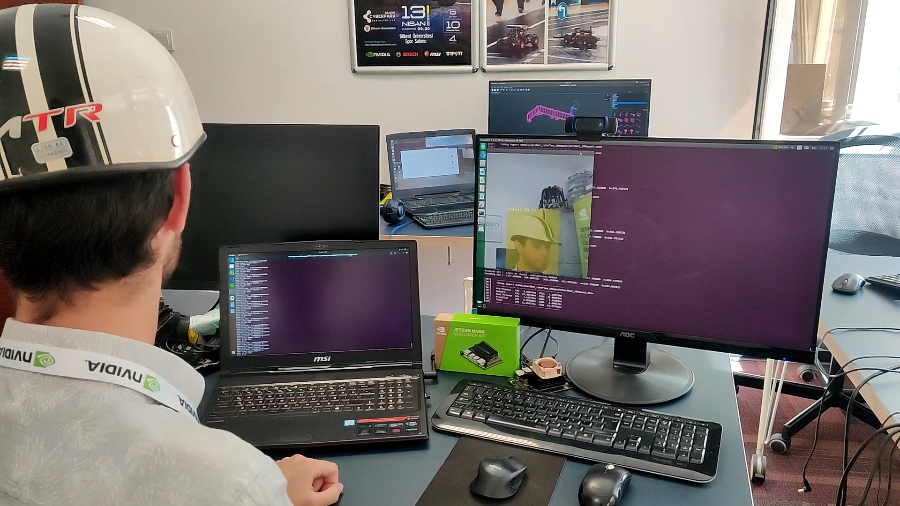

<div align="center">
  
</div>

# Real-Time Detection of People not Wearing Hardhat with NVIDIA Jetson Nano 

## Reason
Most of the deaths and accidents in construction and factories occur when occupational health and safety rules are not followed, and these rules are often not followed. We can say that one of the most important of these rules is to wear a hardhat. When a hardhat is not worn, it can cost people's lives.

I think that the detection of people who do not wear hardhats in work areas with loads can prevent loss of life to some extent.

<div align="center">
  
</div>
<br>

## Project
I developed an object detection model that can detect people not wearing helmets. The model can be found in <a href='model'>here</a>. This project uses:

- Nvidia Jetson Nano (Any Jetson would be fine)
- Logitech C920 (Any camera that Jetson supports would be fine)
- jetson-inference library by [Dustin Franklin](https://github.com/dusty-nv)
- People wearing helmets and not wearing helmets

<br>

### Loss Graph

<div align="center">
  
</div><br>

### Some Demo Photos

<div align="center">
  
</div><br>

<div align="center">
  
</div><br>

### Demo Video

> The video of me taking on and taking off the helmet can be found [here](https://youtu.be/UXpwbg3JUvM).

[Jetson-inference](https://github.com/dusty-nv/jetson-inference) library is awesome! It provides guide and realtime [DNN Vision](https://github.com/dusty-nv/jetson-inference#api-reference) library for [Jetson Nano/TX1/TX2/Xavier NX/AGX Xavier](http://www.nvidia.com/object/embedded-systems.html). Also this project uses NVIDIA [TensorRT](https://developer.nvidia.com/tensorrt) for fast and efficient detection.


[jetson-inference](https://github.com/dusty-nv/jetson-inference) is a library of TensorRT-accelerated deep learning networks for image recognition, object detection with localization (i.e. bounding boxes), and semantic segmentation. This inferencing library (libjetson-inference) is intended to be run on the Jetson, and includes support for both C++ and Python. Various pre-trained DNN models are automatically downloaded to get you up and running quickly.

## Run

### 1. Build jetson-inference from the source with [this guide](https://github.com/dusty-nv/jetson-inference/blob/master/docs/building-repo-2.md#quick-reference)

### 2. Clone the project
```
git clone https://github.com/smlblr/Real-Time-Detection-of-People-not-Wearing-Hardhat real-time-hardhat
```

### 3. Go to the project directory
```
cd real-time-hardhat
```

### 4. Run the demo
#### 4.1. Run with Jetson
```
python3.6 detect_hardhat_jetson.py --model=model/hardhat.onnx --labels=model/labels.txt --input-blob=input_0 --output-cvg=scores --output-bbox=boxes v4l2:///dev/video0 --threshold=0.65
```
#### 4.2. Run without or with Jetson using pth file
```
python3.6 detect_hardhat_demo.py --net-type=mb1-ssd --model=model/hardhat.pth --label=model/labels.txt
```

> The python version and camera may differs for you.
